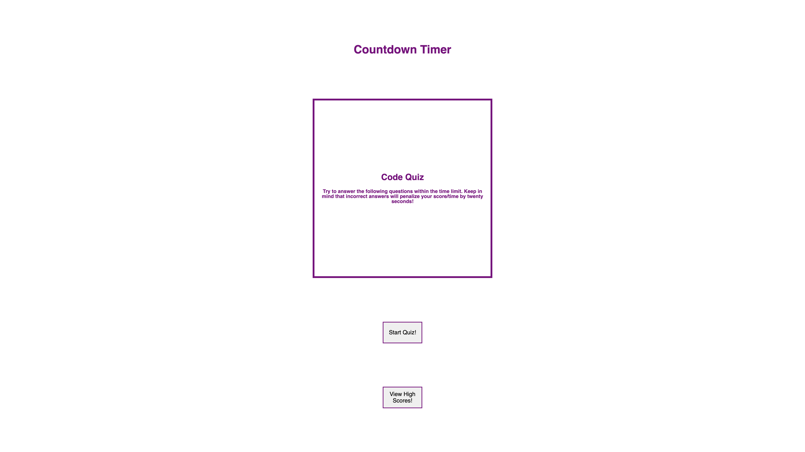

# codeQuiz_w4

Hello! This project involved using querySelector, localStorage, and setInterval properties within Javascript. It is a 5 question quiz where your remaining time is your high score and is printed for you, as well as saved to local storage. 

